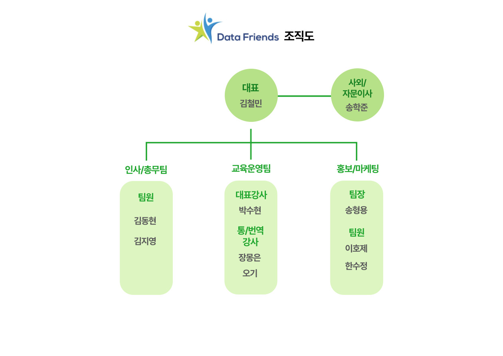

<!-- We have been using R Markdown for the Ocean Health Index:  [**ohi-science.org/ohi-global**](http://ohi-science.org/ohi-global). -->
<!-- And R Markdown is much more than just websites -- here's a [**one-minute video about R Markdown**](http://rmarkdown.rstudio.com/lesson-1.html) to get you excited. -->
